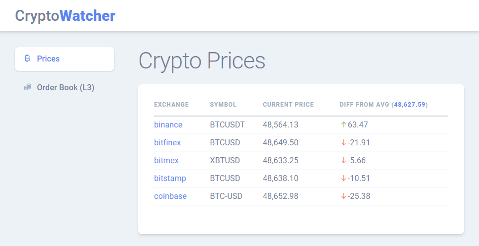

# Cryptocurrency Watcher in Blazor

This sample webassembly application presents possibilities of [crypto-websocket-extensions](https://github.com/Marfusios/crypto-websocket-extensions) library. 

* displaying real-time price changes (under 1ms)
* displaying L3 order book with reporting about price/amount updates of the individual orders

