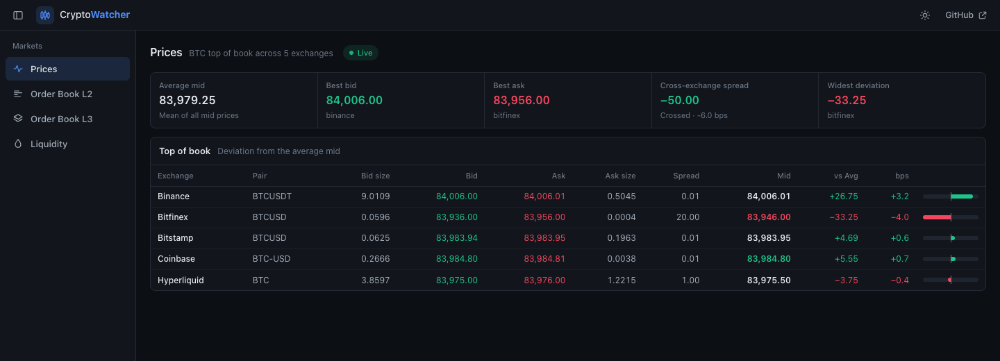
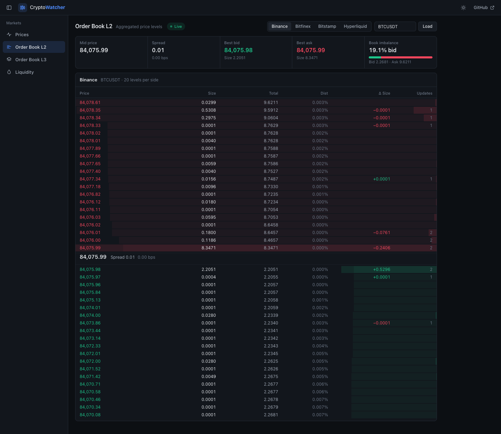
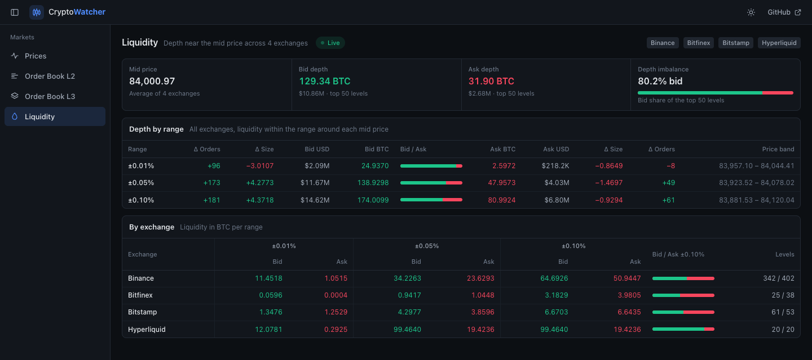

# Cryptocurrency Watcher in Blazor


[](https://crypto.mkotas.cz)

Blazor WebAssembly (.NET 10) application that presents possibilities of the [crypto-websocket-extensions](https://github.com/Marfusios/crypto-websocket-extensions) library. It runs entirely in the browser and streams market data directly from the exchanges over WebSockets. See it live at [crypto.mkotas.cz](https://crypto.mkotas.cz).



## Features

* **Prices** - BTC top of book across Binance, Bitfinex, Bitstamp, Coinbase and Hyperliquid: bid / ask with sizes, spread, deviation from the average mid price, best bid / ask and the cross-exchange spread
* **Order Book L2** - aggregated price levels with depth bars, spread, book imbalance, order counts and size changes; one click switching between Binance, Bitfinex, Bitstamp and Hyperliquid (fast 5-level or deep 20-level feed)
* **Order Book L3** - individual Bitfinex orders with tracking of their price and size updates
* **Liquidity** - depth within ±0.01% / 0.05% / 0.1% of the mid price, across all exchanges and per exchange, with the bid / ask imbalance
* Dark and light theme, collapsible sidebar, responsive layout, installable as an offline capable PWA

| Order Book L2 | Liquidity |
|---|---|
|  |  |

## Running locally

Requires the [.NET 10 SDK](https://dotnet.microsoft.com/download/dotnet/10.0).

```bash
dotnet run --project CryptoWatcher.Blazor/CryptoWatcher.Blazor.csproj -c Release
```

Then open http://localhost:5022. For development with hot reload use `dotnet watch run --project CryptoWatcher.Blazor/CryptoWatcher.Blazor.csproj`, just keep in mind that Debug builds of Blazor WebAssembly are several times slower with fast moving order books.

Every push is published to GitHub Pages by the [gh-pages workflow](.github/workflows/gh-pages.yml).

## Related

CryptoWatcher as a console application: [marfusios/crypto-watcher](https://github.com/Marfusios/crypto-watcher)
